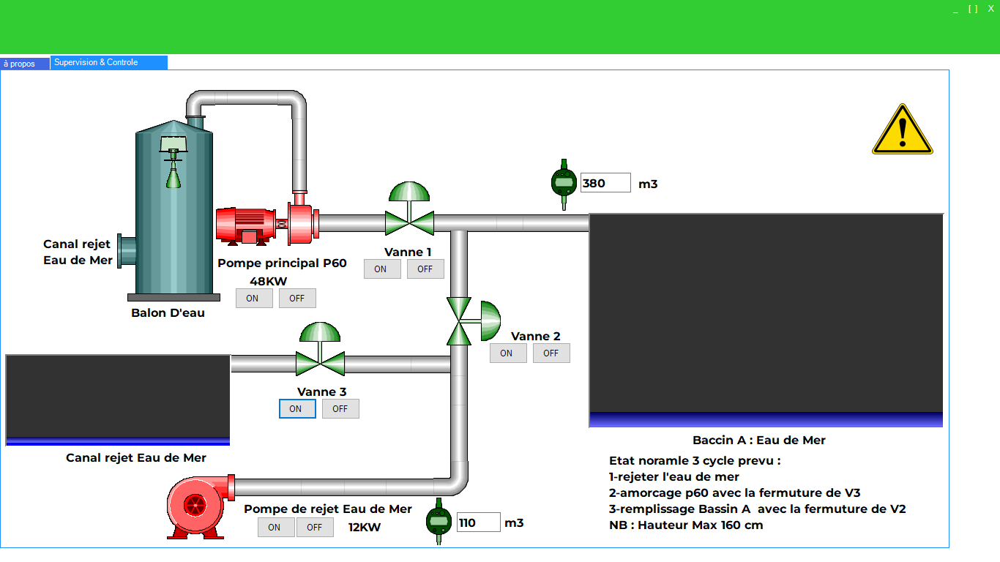
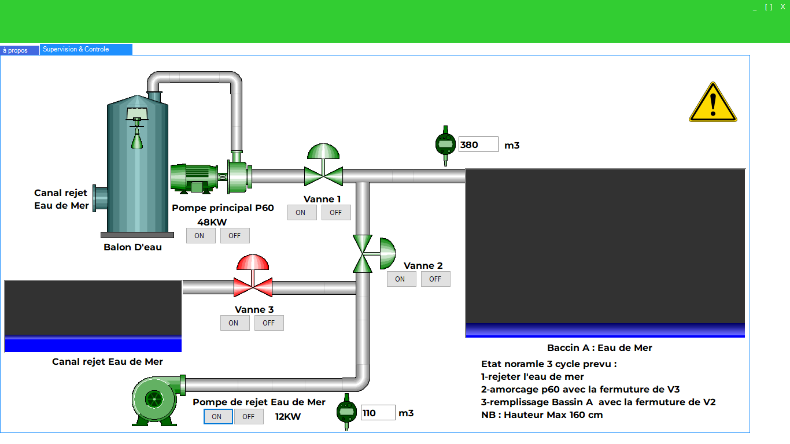

# SudPotassev1.x
Tasks carried out : Design and implementation of an industrial supervision and control platform. Development of a C# application for supervision and control of a seawater pumping station. Real-time data acquisition from a Siemens S7-1500 PLC. Transmission of setpoints to actuators via SCADA protocol.
### Software

 
 
